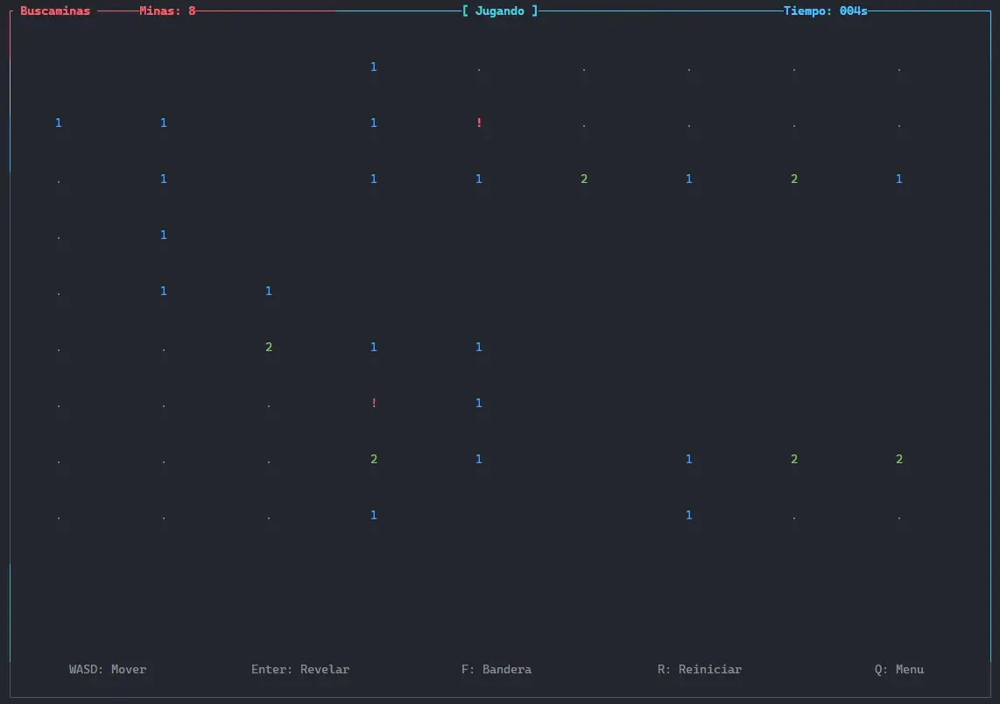

# Buscaminas CLI

Juego de buscaminas implementado en Rust con interfaz TUI moderna.

## Características

- 3 niveles de dificultad (9x9, 16x16, 30x16)
- Interfaz visual a color en terminal
- Timer y contador de minas
- Primer click siempre seguro
- Guardado de configuración

## Controles

| Tecla | Acción |
|-------|--------|
| WASD/Flechas | Mover cursor |
| Enter | Revelar celda |
| F/Espacio | Colocar bandera |
| R | Reiniciar |
| Q | Volver al menú |

## Ejecutar

```bash
cargo run
Tech Stack
- Rust
- ratatui (TUI)
- crossterm


